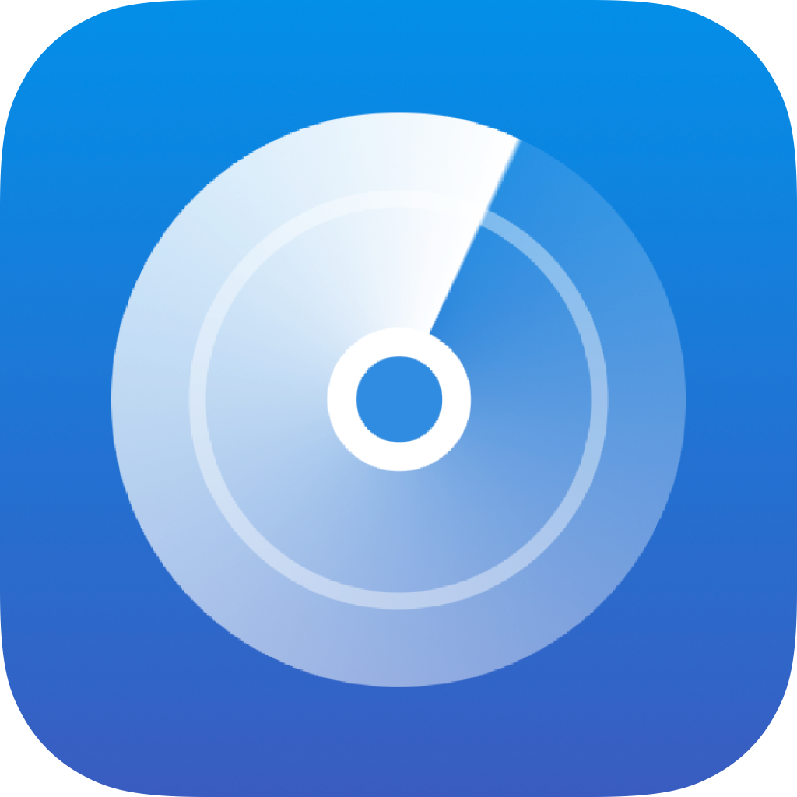
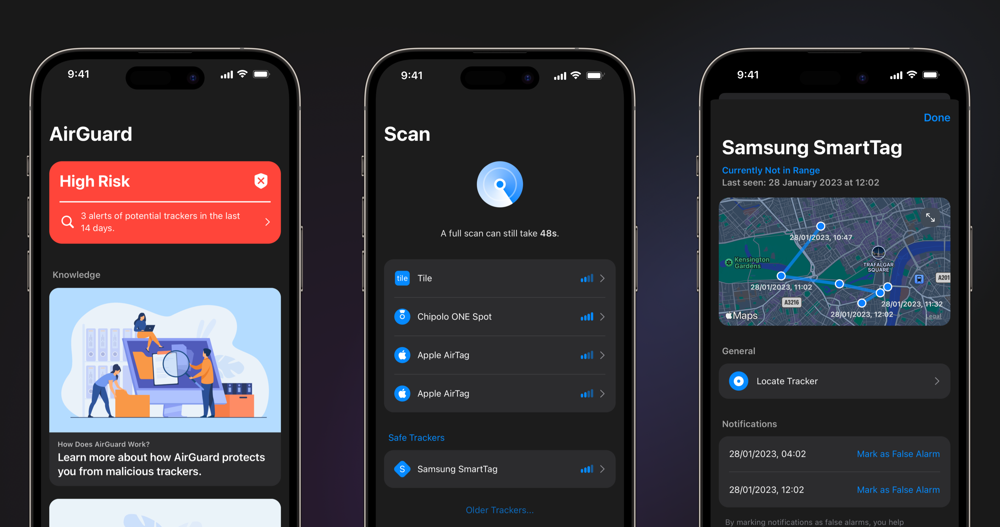

<h5 align="center"></h5>
<h1 align="center">AirGuard for iOS - Tracking protection</h1>

    
    

  

### Protect yourself from Tracking

AirTags are not the only devices that can be used to track you! 
Samsung SmartTags and Tile trackers have similar functionalities. These trackers allow to track your location without your knowledge, just by placing one of them in your bag, pocket or on your car.  
The protection on iOS against these trackers is very limited.   
 
With AirGuard you get the anti-tracking protection you deserve! 
The app periodically scans your surroundings for potential tracking devices. The app detects Bluetooth based trackers, like the Samsung SmartTag.  
If a devices follows you, you will get a notification in about an hour! 

Our *locate tracker* option allows you to scan for specific trackers and to find them. 

## Get the app 
It is available on the [App Store](https://apps.apple.com/app/id1659427454). 

<!-- You can may also join our [TestFlight Beta]() -->

## Details 

###  Who are we?
We are part of the Technical University of Darmstadt in Germany. This project is part of a scientific research from the Secure Mobile Networking Lab. Our goal is to protect privacy and to find out how many people are opposed to tracking.
In this app you can voluntarily participate in a research study that will share anonymized data with us.

This app will never get monetized by showing ads, in-app purchases or anything else.

### How does it work? 

AirGuard uses Bluetooth scans of your iPhone to find trackers nearby. Every tracker that is found will be saved locally on your device. 
Whenever a tracker gets detected multiple times the app will recognize this. It compares the locations where the tracker has been detected. 
If a tracker is detected at least 3 times and the locations have changed (to make sure its not your neighbour) the app sends you a notification. 

All this happens locally on your device and the private information, like location, tracker ids, etc will never leave your device. 

## Compile from source
Download and open this repository in Xcode. 

You have to re-sign the project with your own Apple ID. 

Also, keep in mind that you may need to replace the prefix of the Bundle Identifiers with your identifier.
Those can be found in Project -> Targets -> Signing -> Bundle Identifier

Please also change the App Group names accordingly. This can be done editing the .entitlements files in the root folder of this repository.

## Contact  

We are not able to offer full support for this app. The best way to get things solved is to [start a discussion](https://github.com/seemoo-lab/AirGuard-iOS/discussions) in this repository. 
GitHub issues are closed. Please start a discussion or submit a pull request to the project. 

If you need to get into direct contact, please send an email. You can find our contact details on our [seemoo.de](https://www.seemoo.tu-darmstadt.de/team/aheinrich/).

### Disclaimer
AirTag, FindMy and iOS are trademarks of Apple Inc.
We are not working together with Apple Inc.

SmartTag is a trademark of Samsung Electronics Co., Ltd.
Tile is a Trademark of Life360 Inc. 

